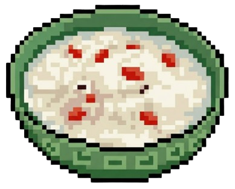

严肃保存语法


type: 
fandom: 
relationship: 
character: 
rating: 
warning: 
status: 


------

# 这是标题
## 这是二级标题
### 这是三级标题


这是信息框

嘿嘿


这是普通文本
*这是斜体*
**这是加粗**
\*这个是加星号\*
~~这是删除线~~ 
`这是高亮`
==这是主题色高亮==
这里有一段 <mark style="background-color: #ffb8b8; color: #ffffff;">粉色荧光笔高亮白色</mark> 的文字。
++这是主题下划线++
这里有一段 红色下划线且带有一点间距 的文字。
<u>这是下划线</u>
这是一个类型为`0`的,这是一个主题颜色的
类型为`1`的遮罩文本，点击后会一直显示，再次点击会重新隐藏，鼠标划过则不会显示。
类型为`2`的遮罩文本是带下划线的挖空形式，点击后，再次点击会隐藏，鼠标划过也不会显示。

这里是普通的文字，而 这里的字是绿色的。
这是用自己写的plugin实现的绿色

这是脚注[^1]
[^1]:这是脚注1

这是缩进，2em等于两个字宽度的距离，可以修改成8em等


这里可以塞你想折叠起来的任何内容。
可以是文字、代码块，甚至可以插入图片。


这是一个[链接](http://example.com/ "链接的名字") 没错
这是我的[本地链接](/tags/) 没错

这是分割线

------

分割线上下必须各空出一行

>这是一段引用
1.没错,还能是一个List
>>还能在引用里引用
>
>
>而且引用里还有一个空行

- 这也是一个list
- 哼哼
	- 哈哈

1. 也可以这样
2. 这样
3\. 如果我不想让3是一个List就这样

|左|右|
|:--|--|
|12|21|


author:
  乌萨奇: https://img0.baidu.com/it/u=893498094,448573105&fm=253&fmt=auto&app=120&f=JPEG?w=245&h=245
  吉伊: https://img2.baidu.com/it/u=107576594,4285659691&fm=253&fmt=auto&app=120&f=JPEG?w=500&h=500
chat:
  - time: 公元前2697年
  - content: 蓝星上会有生物回应吗……*[🔎搜寻呼叫中]*
  - time: 2026年2月17日
  - from: 吉伊
    right: Y
    content: |
      *（正在除草……）*
      呀呀——嗯帕帕——啦啦——欸？
  - from: 乌萨奇
    content: 乌！乌啦啦乌啦～乌啦呀哈啦呀哈！
  - from: 乌萨奇
    content: 乌啦————
    image:
      - https://pic.rmb.bdstatic.com/bjh/events/e3253f008c4c6a71485fdda4c5681dd36947.jpeg@h_256
  - time: 1分钟前
  - from: 吉伊
    right: Y
    image:
      - https://img2.baidu.com/it/u=2917494862,1757992794&fm=253&fmt=auto&app=120&f=JPEG?w=889&h=500


 这是一张图片
 

这是音乐播放器

server: netease
type: playlist
id: 18138558663


这是时间线


<!-- timeline 7月3日 -->
开始搞博客
<!-- endtimeline -->

<!-- timeline 7月15日 -->
做了SPA！
<!-- endtimeline -->

